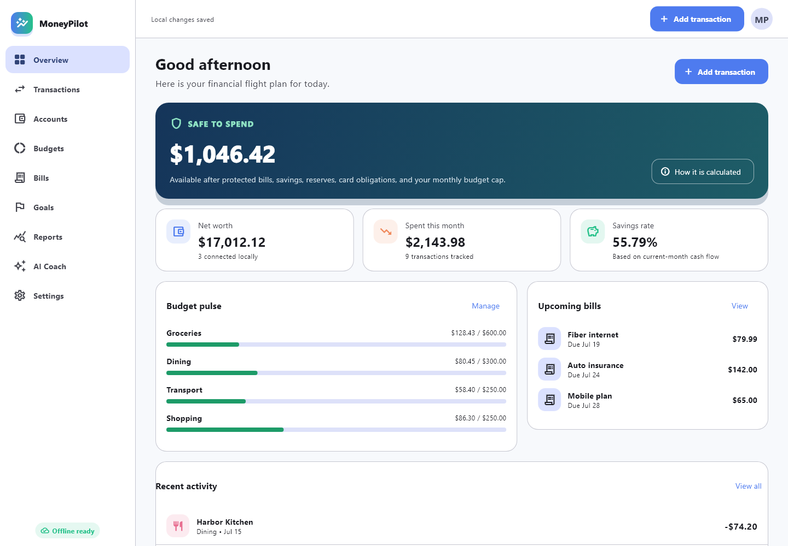
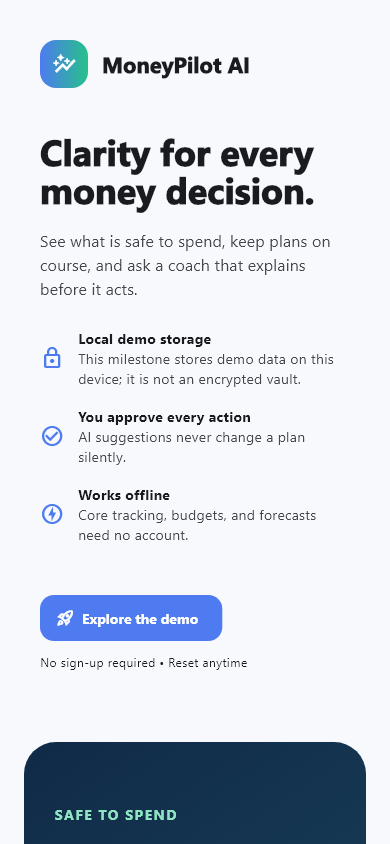

# MoneyPilot

[](https://github.com/elieh999/MoneyPilot/actions/workflows/flutter.yml)
[](https://github.com/elieh999/MoneyPilot/actions/workflows/python.yml)
[](LICENSE)

MoneyPilot is a personal finance app for tracking accounts, transactions,
budgets, bills, and savings goals. The Flutter client works locally on desktop
and mobile, starts with an empty workspace, and keeps each profile separate.

The interface supports English, French, and Arabic, including right to left
layout. It also includes a spending calendar, several color palettes, reports,
purchase checks, and a local financial coach that answers from the records the
user has entered.

The project is still under active development. The desktop client works without
the API. It can verify and authenticate a FastAPI account, but it does not upload
financial records yet.

## Screenshots

| Desktop | Mobile |
| --- | --- |
|  |  |

## What works

- Local account creation, sign in, recovery codes, sign out, and account deletion
- Separate financial data for each local profile
- Accounts, transactions, categories, budgets, bills, and goals
- CSV transaction import and export with row validation and duplicate checks
- Recurring weekly and monthly transaction insights
- Calendar summaries for daily and monthly activity
- Reports, forecasting, and purchase affordability checks
- English, French, and Arabic interface text
- Light, dark, system, and high contrast appearance options
- Ocean, cyan, forest, violet, and sunset color palettes
- Local coach replies based on the active profile's data
- FastAPI endpoints for authentication and financial records
- Automated Flutter and Python tests

## Start on Windows

Download the repository as a ZIP, extract the whole folder, and double-click
`MoneyPilot.exe` in the top-level folder. The included Windows build does not
require Flutter, Python, Docker, or PowerShell.

Keep `MoneyPilot.exe` beside the `MoneyPilot Runtime` folder. Windows SmartScreen
may ask for confirmation because this open-source development build is not code
signed yet.

## Run from source

Developers who want to change the code can install Python 3.12 or newer and
Flutter, then run the helper scripts:

```powershell
.\scripts\setup-dev.ps1
.\scripts\run-api.ps1 -SQLite
```

Start the Flutter client in another terminal:

```powershell
.\scripts\run-flutter.ps1
```

Docker Desktop is optional for the first local run. The API can use SQLite for
development, and the Flutter client can run without the API. See
[Development](docs/DEVELOPMENT.md) for Docker commands, manual setup, and common
problems.

## Project layout

```text
apps/money_pilot/               Flutter client
services/api/                   FastAPI service
packages/financial_core_python/ Shared calculation code
packages/financial_contracts/   Calculation test data
infrastructure/                 Local Docker services
scripts/                        PowerShell helpers
docs/                           Technical notes and screenshots
```

## Tests

Run the available checks from the repository root:

```powershell
.\scripts\check.ps1
```

The script runs Python tests and linting, then Dart formatting, Flutter analysis,
and Flutter tests when those tools are installed.

## Implementation notes

- Money values use integer minor units to avoid floating point rounding errors.
- Transfers do not count as income or expenses.
- API resources are checked against the signed in owner.
- The coach cannot save a proposed change without confirmation.
- Local passwords and recovery codes are hashed with Argon2id.
- Local financial snapshots use authenticated AES-GCM encryption and migrate
  older plaintext snapshots automatically.

## Current limitations

- The Flutter client stores a local snapshot instead of a synchronized database.
- Flutter local profiles and optional FastAPI accounts remain separate identities.
- Remote AI providers are not configured by default.
- The local encryption key is stored separately in app preferences, not in a
  platform hardware-backed key store.
- Store signing, hosted infrastructure, and production monitoring are not part of
  this repository yet.

The main unfinished work is tracked in the [roadmap](docs/ROADMAP.md).

## Documentation

- [Architecture](docs/ARCHITECTURE.md)
- [Data model](docs/DATA_MODEL.md)
- [Development and testing](docs/DEVELOPMENT.md)
- [Financial calculations](docs/FINANCIAL_CALCULATIONS.md)
- [Local Coach](docs/COACH.md)
- [API](services/api/README.md)

## Contributing

Bug reports, focused pull requests, and documentation fixes are welcome. Read
[CONTRIBUTING.md](CONTRIBUTING.md) before opening a change.

## License

MoneyPilot is available under the [MIT License](LICENSE). Bundled fonts and
platform files retain their original licenses as listed in
[THIRD_PARTY_NOTICES.md](THIRD_PARTY_NOTICES.md).
