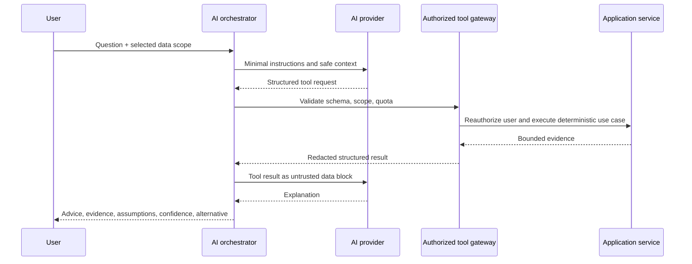
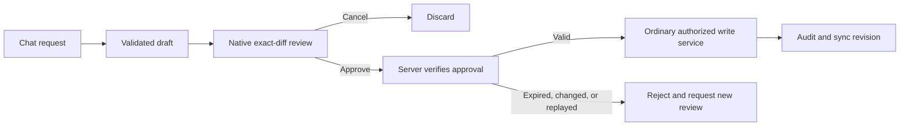

# AI architecture, tools, and action approval

## Principles

AI is optional, provider-neutral, least-privileged, and never a calculation or
authorization authority. The deterministic application produces numbers; the
model selects allowlisted tools and explains returned evidence. MoneyPilot AI
provides educational guidance, not professional financial, tax, investment, or
legal advice.

## Provider abstraction

Domain/application code depends on interfaces such as:

- `ChatCompletionProvider`: streamed structured chat/tool requests.
- `EmbeddingProvider`: optional future retrieval, disabled unless needed.
- `DocumentAnalysisProvider`: receipt extraction behind a separate consent and
  validation boundary.

Adapters may support OpenAI-compatible APIs, other cloud vendors, a deterministic
mock, or future local models. Configuration selects the adapter; provider names,
SDK types, tokens, and response quirks stay inside infrastructure. `disabled` is
a valid production-safe mode.

## Shipped private Local Coach

The desktop/mobile client also contains a no-key offline coach. It uses a bounded
intent engine over the current user's in-memory snapshot, supports conversational
greetings and money questions, and refuses to invent a balance when required
records are missing. It covers safe-to-spend, affordability, income/cash flow,
category spending, balances, bills, goals, and budget drafting. Coaching style is
user selectable. This path sends no financial records to a provider.

The local engine can return only a typed `upsert_budget` draft. The controller
retains the proposal separately from chat, verifies the proposal identifier on
approval, and applies nothing on rejection. A cloud provider can later replace
response composition behind the existing server boundary without changing that
approval contract.

## Tool gateway

Each tool has a versioned JSON schema, read/write risk, maximum result size,
timeout, rate limit, owner-scoped application service, and redaction policy.

| Tool | Permission | Output policy |
|---|---|---|
| `get_financial_summary` | Read summary | Aggregates for explicit period/currency |
| `get_safe_to_spend` | Read calculation | Inputs, deductions, result, confidence |
| `compare_periods` | Read summary | Bounded aggregates and material drivers |
| `list_upcoming_bills` | Read records | Date-bounded, minimal fields |
| `analyze_category_spending` | Read summary | Category totals, budget, trend |
| `search_transactions` | Sensitive read | Narrow filters, capped results, only when necessary |
| `calculate_goal_plan` | Simulation | No persisted mutation |
| `calculate_debt_plan` | Simulation | Assumptions and educational disclaimer |
| `simulate_purchase` | Simulation | Safe-to-spend delta and affected goals/bills |
| `simulate_budget_change` | Simulation | Before/after deterministic results |
| `simulate_income_change` | Simulation | Scenario only, uncertainty labeled |
| `propose_budget` | Draft | Validated exact diff; no write |
| `propose_category_change` | Draft | Validated exact diff; no write |
| `create_user_action_draft` | Draft | Allowlisted action types only |

There is deliberately no arbitrary query, SQL, URL fetch, code, shell, file-read,
delete, approve, or generic mutation tool.

## Orchestration

Merchant names, notes, receipt OCR, imports, files, and previous assistant text
are untrusted content. They are never concatenated into system/developer
instructions. Tool requests from the model are proposals until server validation
and authorization finish.

## Write-action approval

The proposal stores user/session, action type, canonical payload hash, affected
resource versions, before/after diff, risk level, rationale, creation/expiry
(default ten minutes), and status. Approval uses a server-generated single-use
token. Higher-risk actions require recent authentication. The server repeats
validation and authorization, checks unchanged versions and payload hash, then
calls the same service used by normal UI. Chat text—including "yes"—is not an
approval. The model cannot call the approval endpoint.

Deleting data, changing authentication/security/privacy, exporting all data,
moving real money, or changing AI permissions cannot be generalized through
the AI proposal tool. They use dedicated native flows; real money movement is
outside scope.

## Context and memory

- User selects AI disabled, summaries only, selected accounts, or all authorized
  financial data. Default to summaries.
- Build context per turn from explicit data dependencies; cap rows/time ranges
  and prefer aggregates. Never include credentials, hidden ownership fields, or
  unrelated users/data.
- User-controlled memories are short preference statements with provenance and
  timestamp. Users can inspect, edit, delete, or disable them. The model cannot
  silently promote conversation text into memory.
- Conversation deletion and provider-retention behavior follow the privacy
  center and documented processor policy.

## Response contract

Personalized advice returns recommendation, evidence/numbers, period, formula or
reason, assumptions/missing inputs, confidence, potential downside, alternative,
and educational disclaimer where relevant. If evidence is insufficient, say so
and ask only for essential information. Citations refer to internal result IDs,
not invented sources.

## Resilience and cost

Timeout, rate limit, malformed tool call, provider refusal, and streaming
disconnect map to recoverable UI states. Never retry a draft/write automatically.
Track latency, token/cost totals, tool outcomes, and safety events without logging
sensitive content. Per-user quotas and maximum tool-call depth prevent loops.

## Required tests

Schema rejection, unknown tool, cross-user ID, selected-account restriction,
prompt injection in every untrusted field, oversized result, recursive tool loop,
provider timeout/malformed output, hidden prompt exfiltration, arbitrary SQL/code,
proposal payload swap, stale resource version, expired/replayed approval,
concurrent approvals, AI disabled, and deterministic mock behavior.
