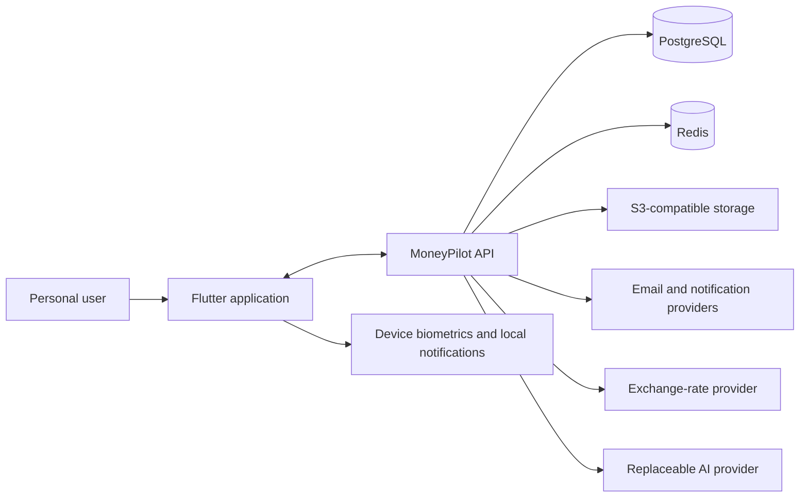
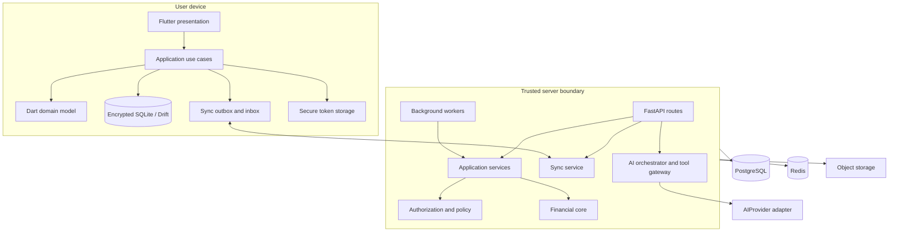
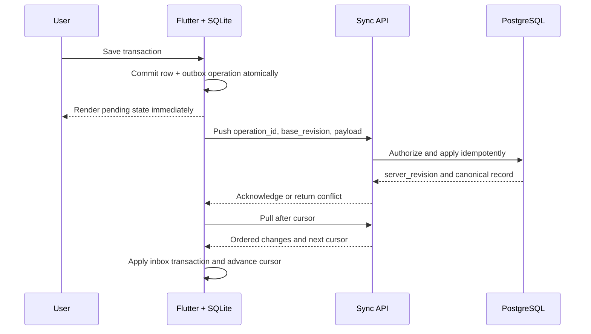

# Architecture

## Context

Core financial recording remains usable when the API or optional providers are
unavailable. Bank connections and money movement are not part of the MVP trust
boundary.

## Containers

## Architectural decisions

| Concern | Decision |
|---|---|
| Product identity | `MoneyPilot AI`; display name remains configuration-driven. |
| Client | Flutter clean architecture with feature modules and responsive navigation. |
| API | Python 3.12+, FastAPI, Pydantic, SQLAlchemy 2, Alembic, versioned REST/OpenAPI. |
| Money | Integer minor units in domain contracts; `Decimal` for rates/intermediate math; `ROUND_HALF_UP`; currency code and scale are mandatory. |
| Persistence | SQLite is the client rendering source; PostgreSQL is the synchronized server record. |
| Sync | Operation outbox, idempotency keys, server revisions, cursor pull, tombstones, and explicit critical-field conflicts. |
| Realtime | WebSocket/SSE is a wake-up hint; correctness comes from cursor-based pull, not message delivery. |
| Authentication | Short-lived access token; rotated, hashed refresh tokens per device; biometrics only unlock local credentials. |
| Files | Private S3 objects; short-lived signed URLs; metadata and ownership stored server-side. |
| AI | Provider-neutral adapter; structured allowlisted tools; no arbitrary SQL/code; exact-diff action approval. |
| Jobs | Durable background queue; idempotent, retry-safe, observable tasks with deduplication. |
| Time | Server timestamps are UTC; calendar semantics use the user's IANA timezone. |

## Request path

1. Route parses a strict schema and attaches correlation/authentication context.
2. Application service loads the resource through an owner-scoped repository.
3. Policy checks operation, resource state, and optional step-up authentication.
4. Domain/financial core validates invariants and computes deterministic values.
5. One database transaction writes state, audit metadata, sync revision, and any
   outbox event.
6. Response uses a stable envelope and never exposes internal exceptions.

AI tools enter at step 2 and receive no privileged bypass. Background jobs use
service identities with explicit capabilities and call the same services.

## Offline write and convergence

## Deployment topology

Production separates the API, worker/scheduler, managed PostgreSQL, managed
Redis, private object storage, and secrets manager. The API is stateless and may
scale horizontally. Migrations run as a single release job before compatible
application rollout. `infrastructure/docker-compose.yml` is development-only.

## Failure boundaries

- Loss of realtime delivery triggers the next poll; it cannot lose data.
- Provider AI failure returns a recoverable unavailable state; no core workflow
  depends on AI.
- OCR/import failures preserve the source and row-level diagnostics for review.
- Redis loss may reduce caching/async capacity but must not bypass authorization
  or corrupt the ledger.
- A database write and its sync/audit metadata commit together or roll back.
