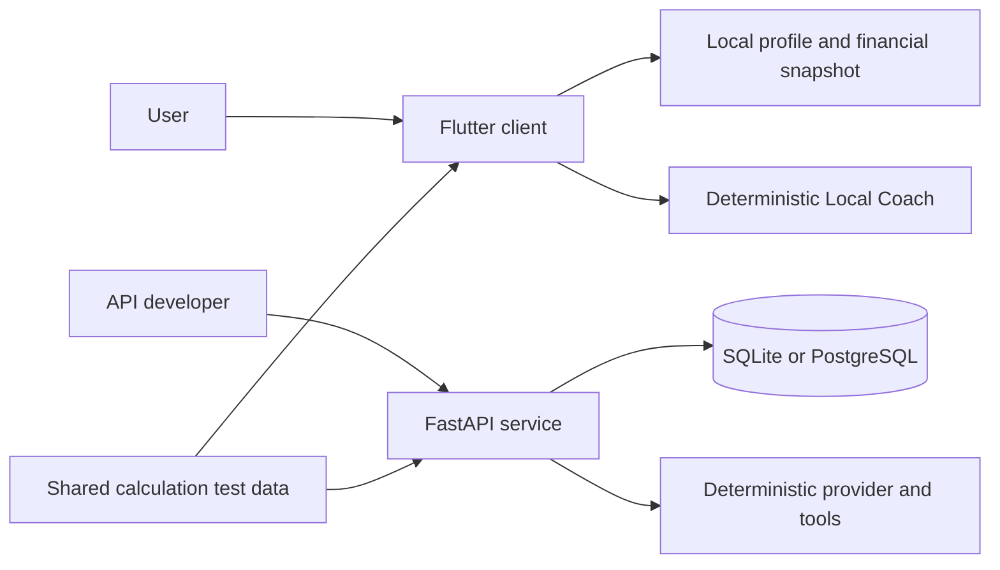

# Architecture

MoneyPilot currently has two application paths: a standalone Flutter client and
a FastAPI service. They share financial rules and concepts, but the client is
not yet connected to the API.

## Flutter client

The client lives in `apps/money_pilot`. Riverpod manages application state and
GoRouter handles navigation. Responsive screens support desktop and mobile
layouts.

Local users, password hashes, recovery code hashes, settings, and financial
snapshots are stored through `shared_preferences`. Each financial snapshot uses
a key derived from the local user ID, which keeps profiles separate on the same
device.

The current storage format is a serialized application snapshot. It is useful
for local development, but it is not a replacement for an encrypted database,
transactions, migrations, or a synchronization queue.

## FastAPI service

The API lives in `services/api` and exposes versioned routes under `/api/v1`.
It uses Pydantic schemas, SQLAlchemy models, and Alembic migrations. SQLite is
the default development database; PostgreSQL is available through configuration
and the Docker Compose environment.

API services check resources against the authenticated owner. Money is stored in
integer minor units, and transfers update both owned accounts without entering
income or expense totals.

The committed OpenAPI document is generated from the FastAPI application and is
checked by the test suite.

## Shared financial rules

Python calculation helpers live in `packages/financial_core_python`. Language
neutral examples in `packages/financial_contracts/vectors.json` are exercised by
both the Python and Flutter test suites. This catches differences in rounding,
budget status, savings rate, and safe to spend calculations.

## Local infrastructure

`infrastructure/docker-compose.yml` provides PostgreSQL, Redis, MinIO, Mailpit,
and the API for local development. Redis, MinIO, and Mailpit are available to
support future integrations; they are not authoritative financial storage.

## Boundaries to keep visible

- Flutter authentication and API authentication are currently separate.
- The Flutter sync gateway does not transmit financial data.
- The local coach and API provider are deterministic by default.
- No production hosting configuration is included.
- Local financial snapshots are not database level encrypted.

These gaps are listed in [ROADMAP.md](ROADMAP.md) so the repository does not
present planned infrastructure as finished behavior.
