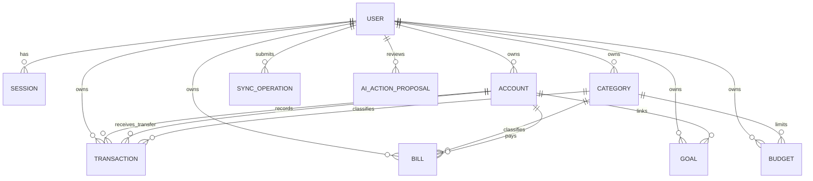

# Data model

MoneyPilot currently has two separate storage models. The Flutter client saves
one encrypted local snapshot per profile. The optional FastAPI service uses a
relational database. The client does not synchronize financial records with the
API yet.

## Flutter snapshot

`apps/money_pilot/lib/src/models.dart` defines the local snapshot. It contains:

- accounts
- spending categories
- transactions
- monthly budgets
- bills
- savings goals
- coach messages and pending coach actions
- application settings

New profiles contain the built in category list but no accounts, transactions,
budgets, bills, goals, or invented balances. The complete snapshot is serialized
and protected with authenticated AES-GCM encryption before it is written through
`shared_preferences`.

This format is convenient for a local application, but it does not provide
database transactions, migrations, queries, or synchronization history.

## API database

The current SQLAlchemy models are in
`services/api/src/money_pilot_api/models.py`.

The implemented tables are:

- `users` and `sessions`
- `accounts` and `categories`
- `transactions`
- `budgets`, `bills`, and `goals`
- `sync_operations`
- `ai_action_proposals`

Most financial records use UUID identifiers, integer minor units for money,
created and updated timestamps, a version number, and a soft deletion timestamp.
Every API query scopes owned resources to the authenticated `user_id`.

Transactions store one source account and an optional destination account. A
transfer is currently represented by one transaction that updates both owned
accounts. Transaction splits and transfer group tables are not implemented.

## Not implemented yet

The following ideas are not part of the current database:

- user profiles, devices, and security event tables
- transaction splits, attachments, tags, and merchant tables
- income schedules, budget periods, and bill occurrences
- goal contribution history
- debts, assets, exchange rates, and net worth snapshots
- imports, exports, receipts, notifications, and user file storage
- AI conversation, message, memory, evidence, and feedback tables

These should be added only when a feature needs them, together with a migration,
API schema, ownership checks, and tests.

## Future synchronization

The API has an experimental `sync_operations` endpoint, but the Flutter client
does not send its local snapshot to it. A usable synchronization system still
needs a client change queue, server pull cursor, conflict handling, and an
identity link between local profiles and API users. That work is tracked in the
[roadmap](ROADMAP.md).
