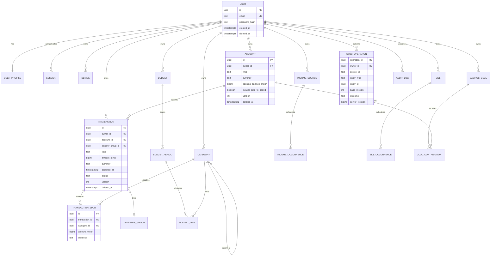

# Data model and entity relationship diagram

## Conventions

Financial entities use UUIDs, authenticated `owner_id`, UTC `created_at` and
`updated_at`, `deleted_at` tombstones where appropriate, monotonic `version`, and
`source`. Money stores integer minor units plus ISO 4217 currency. Flexible JSON
is limited to provider metadata or versioned snapshots; searchable domain data
is normalized.

Public schemas never accept authoritative owner, audit, approval, or revision
fields. Foreign keys and service policies preserve financial history. A user
deletion workflow, rather than informal cascades, controls erasure.

## Entity groups

- **Identity/security:** users, profiles, preferences, identities, sessions,
  devices, security events, recovery codes.
- **Ledger:** accounts, balance snapshots, reconciliations, transactions,
  transfer groups, transaction splits, attachments, merchants, categories,
  rules, tags, transaction tags.
- **Planning:** income sources, salary plans/deductions/allocations, budgets,
  periods and category lines, bills and occurrences, goals and contributions,
  emergency fund configuration.
- **Advanced finance:** subscriptions and price history, debts and payments,
  assets, net worth snapshots, forecast scenarios and points, exchange rates.
- **Operations:** sync operations, server revisions for each user, audit logs,
  notifications/preferences, imports/rows, exports, receipts/items, user files.
- **AI:** conversations, messages, tool calls, action proposals/approvals,
  memories, insights, evidence, and feedback.

## Current data map

## Ledger decisions

- Amounts are zero or greater; transaction `kind` determines direction.
  This avoids ambiguous APIs with mixed signs. Refunds reduce the original expense
  category when linked; otherwise they are reported as unallocated refunds, not
  salary/income.
- A transfer is two linked account legs sharing `transfer_group_id`, written in
  one transaction. Transfers between currencies retain source amount, destination
  amount, currencies, and applied rate.
- Account balance is derived from opening balance plus posted ledger entries.
  Cached/snapshot balances include an `as_of_revision`; reconciliation creates
  an explicit adjustment rather than rewriting history.
- Split totals must equal the parent amount in the same currency. Rounding
  remainder is assigned consistently to the last visible split.
- Pending entries affect available balance policy but not finalized reports.

## Constraints and indexes

- Unique normalized email; unique `(owner_id, device_id, refresh_token_family)`;
  unique `(owner_id, operation_id)` and import row fingerprint per import.
- Checks for valid currency and scale, amounts of zero or greater, valid date ranges,
  supported entity states, and exactly two balanced transfer legs.
- Owner and date indexes on transactions; owner, status, and due date indexes on bills;
  owner/deleted/version indexes for sync; expiry indexes on sessions, proposals,
  exports, and upload reservations.
- Partial indexes should exclude tombstoned rows for ordinary queries while
  preserving tombstones until all active device retention windows pass.

## Possible household support

Future sharing introduces `workspace`, `workspace_member`, and scoped roles.
Until that migration exists, `owner_id` is always the authenticated user. Do not
simulate sharing by accepting another user's ID or weakening repository filters.
