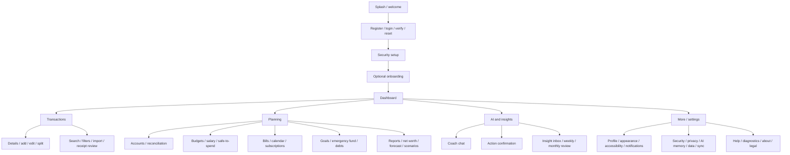

# Design system and screen map

## Experience direction

MoneyPilot AI should feel calm, trustworthy, spacious, and practical—not like a
bank branch, stock terminal, casino, or childish rewards app. Numbers have clear
hierarchy, advice is supportive, and potentially alarming states use plain
language rather than aggressive color.

## Foundation tokens

Use semantic tokens so light, dark, system, and high-contrast themes can differ
without feature-specific colors.

| Role | Light starting value | Meaning |
|---|---|---|
| Background | `#F6F8FA` | App canvas |
| Surface | `#FFFFFF` | Cards/dialogs |
| Text primary | `#17212B` | Main copy and values |
| Text secondary | `#536273` | Supporting copy |
| Primary | `#0B6E69` | Key actions/selection |
| Secondary | `#496A81` | Informational accents |
| Positive | `#217A4B` | Healthy/complete plus icon/label |
| Warning | `#8A5A00` | Caution plus icon/label |
| Danger | `#B42318` | Destructive/critical plus icon/label |
| Outline | `#667085` | Boundaries/focus support |

Verify actual foreground/background pair contrast in automated and manual tests;
the table is not a waiver. Charts use patterns, labels, and shapes in addition to
color. Financial status is always text: Healthy, Caution, At risk, or Exceeded.

- Typography: platform-aware sans; display 32/40, headline 24/32, title 20/28,
  body 16/24, supporting 14/20, label 12/16. Use tabular figures for aligned
  amounts, never tiny text for essential values.
- Spacing: 4-point base; common tokens 4, 8, 12, 16, 24, 32, 48, 64.
- Radius: 8 controls, 12 cards, 16 sheets/dialogs; avoid decorative pill overload.
- Touch targets: minimum 44x44 logical pixels (48 preferred). Desktop targets
  retain visible focus and sufficient pointer area.
- Motion: 120-240 ms functional transitions; reduced-motion removes movement,
  not information.

Reusable components include money amount/privacy placeholder, account selector,
transaction row, budget progress with text state, safe-to-spend breakdown,
evidence card, insight card with feedback, chart plus accessible summary, sync
status, offline banner, exact-diff approval sheet, skeleton, empty state, error
recovery, date/currency inputs, command palette, and destructive confirmation.

## Responsive navigation

- Compact `<600`: bottom navigation Home, Transactions, Budget, AI Coach, More;
  central quick action opens Expense, Income, Transfer, Bill, Receipt, and Goal.
- Medium `600-1023`: navigation rail and two-pane detail where useful.
- Expanded `>=1024`: collapsible sidebar, command palette, resizable content,
  contextual detail panel, and keyboard shortcuts.
- Very wide screens use bounded readable regions and useful columns rather than
  stretching mobile cards.

Desktop shortcuts: `Ctrl/Cmd+N` add transaction, `Ctrl/Cmd+K` command palette,
`Ctrl/Cmd+F` search, `Ctrl/Cmd+Shift+E` expense, `Ctrl/Cmd+Shift+I` income, and
`/` focus search when it does not conflict with text input.

## Screen map

Phase 1 implements auth/security shell, onboarding, dashboard, accounts,
transactions/details/add/edit/split/search, categories, sync status, core
settings, offline/empty/error states, and account deletion entry. Phase 2 adds
budgets, salary allocations, safe-to-spend details, bills/calendar, goals,
reports, and import/export. AI screens are Phase 3; debts, subscriptions, OCR,
net worth, and advanced forecasts are Phase 4.

## Key interaction rules

- Quick entry is at most two primary actions once defaults exist. Natural-language
  and OCR results are always previews, never silent commits.
- Dashboard answers balance, spend, safe-to-spend, next salary, upcoming bills,
  plan status, progress, and material anomalies without an endless card feed.
- "How calculated?" shows values, period, currency/rate, missing inputs,
  uncertainty, and links to contributing records.
- AI action confirmation is a native exact diff, separate from chat, with cancel
  equal in prominence and no preselected approval.
- Destructive actions state scope, sync impact, recovery window, and whether
  reauthentication is required.
- Privacy mode replaces sensitive values consistently while preserving layout;
  accessibility labels must not reveal hidden amounts.

## Accessibility and localization

All actions have semantic labels, logical traversal, visible focus, full desktop
keyboard access, screen-reader announcements, scalable text, reduced motion,
non-color state, accessible chart summaries, and announced form errors. No
hard-coded user-facing strings. Layouts support RTL, local currency/date/decimal
formats, pluralization, and locale-specific week starts. English ships first.
